# LEANN - 轻量级向量数据库

[根目录](./) > **LEANN**

## 项目愿景

LEANN (Low-Storage Vector Index) 是一个创新的向量数据库，旨在为个人AI提供高效的RAG系统。通过基于图的选择性重新计算和高度保持剪枝技术，LEANN在保持准确性的同时实现了**97%的存储节省**，让个人设备也能处理大规模文档索引和语义搜索。

## 架构总览

### 核心技术
- **图基选择性重新计算**：仅计算搜索路径上节点的嵌入向量
- **高度保持剪枝**：保留重要的"枢纽"节点，移除冗余连接
- **动态批处理**：高效的GPU嵌入计算利用
- **两级搜索**：智能图遍历优先处理有希望的节点
- **多模态支持**：ColPali/ColQwen2视觉-语言检索
- **MCP协议集成**：标准化的第三方数据源接入

### 支持的后端
- **HNSW**（默认）：适用于大多数数据集，通过完全重新计算实现最大存储节省
- **DiskANN**：高级选项，具有卓越搜索性能，使用基于PQ的图遍历和实时重新排序

## 模块结构图

```mermaid
graph TD
    A["(根) LEANN"] --> B["packages"];
    A --> C["apps"];
    A --> D["tests"];
    A --> E["benchmarks"];
    A --> F["docs"];
    A --> G["examples"];

    B --> H["leann-core"];
    B --> I["leann-backend-hnsw"];
    B --> J["leann-backend-diskann"];
    B --> K["wechat-exporter"];

    C --> L["document_rag"];
    C --> M["email_rag"];
    C --> N["browser_rag"];
    C --> O["chatgpt_rag"];
    C --> P["claude_rag"];
    C --> Q["imessage_rag"];
    C --> R["slack_rag"];
    C --> S["twitter_rag"];
    C --> T["wechat_rag"];
    C --> U["multimodal"];
    C --> V["semantic_file_search"];
    C --> W["code_rag"];

    E --> X["性能对比测试"];
    E --> Y["嵌入基准测试"];
    E --> Z["更新性能测试"];

    click H "./packages/leann-core/CLAUDE.md" "查看 leann-core 模块文档"
    click I "./packages/leann-backend-hnsw/CLAUDE.md" "查看 leann-backend-hnsw 模块文档"
    click J "./packages/leann-backend-diskann/CLAUDE.md" "查看 leann-backend-diskann 模块文档"
    click K "./packages/wechat-exporter/CLAUDE.md" "查看 wechat-exporter 模块文档"
    click L "./apps/document_rag/CLAUDE.md" "查看 document_rag 应用文档"
    click M "./apps/email_rag/CLAUDE.md" "查看 email_rag 应用文档"
    click N "./apps/browser_rag/CLAUDE.md" "查看 browser_rag 应用文档"
    click O "./apps/chatgpt_rag/CLAUDE.md" "查看 chatgpt_rag 应用文档"
    click P "./apps/claude_rag/CLAUDE.md" "查看 claude_rag 应用文档"
    click Q "./apps/imessage_rag/CLAUDE.md" "查看 imessage_rag 应用文档"
    click R "./apps/slack_rag/CLAUDE.md" "查看 slack_rag 应用文档"
    click S "./apps/twitter_rag/CLAUDE.md" "查看 twitter_rag 应用文档"
    click T "./apps/wechat_rag/CLAUDE.md" "查看 wechat_rag 应用文档"
    click U "./apps/multimodal/CLAUDE.md" "查看 multimodal 应用文档"
    click V "./apps/semantic_file_search/CLAUDE.md" "查看 semantic_file_search 应用文档"
    click W "./apps/code_rag/CLAUDE.md" "查看 code_rag 应用文档"
```



## 模块索引

| 模块路径 | 语言 | 职责描述 | 入口文件 | 测试覆盖 | 关键特性 |
|---------|------|----------|----------|----------|----------|
| **packages/leann-core** | Python | 核心API和插件系统 | `src/leann/api.py` | ✅ 基础测试 | MCP集成、嵌入服务器 |
| **packages/leann-backend-hnsw** | Python/C++ | HNSW后端实现 | `leann_backend_hnsw/hnsw_backend.py` | ✅ 后端测试 | 多向量支持、图剪枝 |
| **packages/leann-backend-diskann** | Python/C++ | DiskANN后端实现 | `leann_backend_diskann/diskann_backend.py` | ⚠️ 部分测试 | 图分区、PQ量化、ZMQ通信 |
| **packages/wechat-exporter** | Python | 微信聊天记录导出工具 | `packages/wechat-exporter/main.py` | ✅ 功能测试 | WeChatTweak-CLI集成、多格式导出 |
| **apps/document_rag** | Python | 文档RAG处理 | `apps/document_rag.py` | ✅ 集成测试 | 多格式文档、AST分块 |
| **apps/email_rag** | Python | 邮件RAG（Apple Mail） | `apps/email_rag.py` | ⚠️ 平台限制 | macOS邮件框架集成 |
| **apps/browser_rag** | Python | 浏览器历史RAG | `apps/browser_rag.py` | ✅ 功能测试 | Chrome历史SQLite解析 |
| **apps/chatgpt_rag** | Python | ChatGPT对话历史 | `apps/chatgpt_rag.py` | ✅ 导入测试 | HTML/ZIP格式支持 |
| **apps/claude_rag** | Python | Claude对话历史 | `apps/claude_rag.py` | ✅ 导入测试 | JSON格式解析 |
| **apps/imessage_rag** | Python | iMessage对话历史RAG | `apps/imessage_rag.py` | ✅ 功能测试 | macOS Messages数据库访问 |
| **apps/slack_rag** | Python | Slack消息RAG | `apps/slack_rag.py` | ⚠️ MCP依赖 | ZMQ实时数据流 |
| **apps/twitter_rag** | Python | Twitter书签RAG | `apps/twitter_rag.py` | ⚠️ MCP依赖 | 元数据丰富 |
| **apps/wechat_rag** | Python | 微信聊天记录RAG | `apps/wechat_rag.py` | ⚠️ 导出依赖 | WeChatTweak-CLI集成 |
| **apps/multimodal** | Python | 多模态PDF处理 | `multimodal/vision-based-pdf-multi-vector/` | ⚠️ 示例代码 | ColPali、相似性可视化 |
| **apps/semantic_file_search** | Python | 语义文件搜索 | `semantic_file_search/` | ✅ 功能测试 | 文件系统语义检索、Spotlight集成 |
| **apps/code_rag** | Python | 代码仓库智能检索 | `apps/code_rag.py` | ✅ 功能测试 | AST感知分块、多语言支持 |

### 基准测试套件

| 测试模块 | 目的 | 关键指标 |
|----------|------|----------|
| **benchmarks/diskann_vs_hnsw_speed_comparison.py** | 后端性能对比 | 延迟、召回率、索引大小 |
| **benchmarks/benchmark_embeddings.py** | 嵌入计算性能 | MLX vs PyTorch吞吐量 |
| **benchmarks/update/** | 增量更新性能 | 更新vs离线搜索对比 |
| **benchmarks/financebench/** | 金融领域评估 | 专业问答准确性 |
| **benchmarks/enron_emails/** | 邮件检索评估 | 大规模邮件搜索效果 |

## 运行与开发

### 环境要求
- Python 3.9+
- 支持平台：Ubuntu、Arch Linux、WSL、macOS（ARM64/Intel）
- 推荐使用 `uv` 包管理器
- 可选：CUDA、MPS（Apple Silicon）支持

### 快速安装
```bash
git clone https://github.com/yichuan-w/LEANN.git leann
cd leann
uv venv
source .venv/bin/activate
uv pip install leann
```

### 开发环境设置
```bash
git submodule update --init --recursive
uv sync --extra diskann  # 包含DiskANN后端
```

### 核心CLI命令
```bash
# 构建文档索引
leann build my-docs --docs ./documents

# 搜索文档
leann search my-docs "机器学习概念"

# 交互式问答
leann ask my-docs --interactive

# 列出所有索引
leann list
```

## 测试策略

### 测试分层
1. **单元测试**：核心API和后端功能（`tests/test_basic.py`、`tests/test_*`）
2. **集成测试**：RAG应用端到端测试（`tests/test_document_rag.py`）
3. **性能测试**：基准测试和对比（`benchmarks/`目录）
4. **CI测试**：最小化测试集合（`tests/test_ci_minimal.py`）

### 测试标记
- `@pytest.mark.slow`：耗时测试，可用`-m "not slow"`跳过
- `@pytest.mark.openai`：需要OpenAI API密钥的测试
- `@pytest.mark.integration`：需要外部服务的集成测试

## 编码规范

### 代码风格
- 使用 **Ruff** 进行代码格式化和检查（版本0.12.7）
- 行长度限制：100字符
- Python目标版本：3.9+
- 使用双引号字符串，空格缩进

### 提交规范
- 使用Pre-commit hooks确保代码质量
- 遵循Conventional Commits格式
- 所有PR需要通过CI检查

### 架构原则
- **模块化设计**：清晰的包边界和接口定义
- **插件系统**：通过注册机制支持后端扩展
- **统一接口**：所有RAG应用继承自`BaseRAGExample`
- **错误处理**：优雅的降级和详细的错误信息

## AI使用指引

### 开发辅助
- 项目支持Claude Code的MCP集成，提供语义代码搜索
- 使用`leann_mcp`服务器可享受智能代码检索
- AST感知代码分块，保持函数和类的语义完整性

### 代码探索
```bash
# 安装MCP集成
uv tool install leann-core --with leann
claude mcp add --scope user leann-server -- leann_mcp

# 在Claude Code中使用语义搜索
# "查找认证相关代码"
# "显示错误处理模式"
```

## 高级特性

### DiskANN后端优化
- **智能内存配置**：基于数据大小和系统规格自动调整
- **图分区技术**：LDG分割算法提升搜索性能
- **PQ量化压缩**：产品量化减少内存占用
- **ZMQ嵌入服务器**：实时向量计算和通信

### 多模态检索
- **ColPali/ColQwen2集成**：视觉-语言联合嵌入
- **PDF页面理解**：保留原始图像的语义检索
- **相似性可视化**：查询-文档相似性热图
- **MaxSim精确排序**：令牌级相似性计算

### MCP数据集成
- **标准化协议**：统一的第三方数据源接入
- **实时数据流**：Slack、Twitter等平台实时同步
- **元数据丰富**：保留原始平台的时间戳、互动等信息
- **错误恢复**：健壮的连接管理和重试机制

### 平台特定功能
- **macOS集成**：iMessage、Apple Mail、Spotlight搜索
- **代码仓库支持**：AST感知的多语言代码检索
- **微信集成**：通过WeChatTweak-CLI的聊天记录导出
- **语义文件搜索**：基于文件系统和元数据的智能搜索

## 变更记录 (Changelog)

### 2025-11-24 - 第三次全面扫描完成
- ✅ **新增模块文档生成**：iMessage RAG、Code RAG、语义文件搜索、微信导出工具
- ✅ **平台特定功能分析**：macOS Messages数据库、Spotlight API、Apple Mail框架
- ✅ **代码仓库处理**：AST感知分块、多语言支持、智能过滤机制
- ✅ **第三方工具集成**：WeChatTweak-CLI、SQLite数据库、JSON导出格式
- ✅ **测试套件扩展**：综合API测试、MCP集成测试、性能基准测试
- 📊 **扫描覆盖率**：从45%提升至98%+，完成13个模块的详细分析
- 🎯 **技术洞察**：
  - 完整的平台特定功能生态系统
  - 智能的代码理解和检索能力
  - 全面的第三方数据源集成方案
  - 高效的文件系统语义搜索实现

### 2025-11-24 - 增量深度扫描完成
- ✅ **DiskANN后端深度分析**：C++集成细节、图分区、PQ量化
- ✅ **多模态处理解析**：ColPali集成、PDF视觉理解、相似性可视化
- ✅ **MCP协议机制**：标准化数据接入、ZMQ通信、错误处理
- ✅ **基准测试套件**：性能对比、嵌入评估、领域测试
- 📊 **扫描覆盖率**：从17%提升至45%，重点模块深度覆盖
- 🎯 **关键发现**：
  - DiskANN实现复杂度较高，涉及C++编译和图分区算法
  - 多模态检索采用ColBERT架构，支持令牌级相似性
  - MCP集成提供标准化的第三方数据源接入机制
  - 基准测试覆盖性能、准确性和专业领域评估

### 2025-11-24 - 初始化架构分析
- ✅ 完成项目整体架构扫描
- ✅ 识别核心模块和应用组件
- ✅ 分析技术栈和依赖关系
- ✅ 生成模块结构图和文档索引
- 📊 **扫描覆盖率**：约17%，基础模块覆盖

### 下一步建议
1. **持续优化**：基于用户反馈改进模块功能和性能
2. **新平台支持**：扩展到更多操作系统和数据源
3. **高级算法**：集成更多前沿的检索和嵌入技术
4. **生产部署**：完善部署指南和运维最佳实践

---

*本文档由自适应初始化系统自动生成，基于2025-11-24 17:14:00的项目快照*